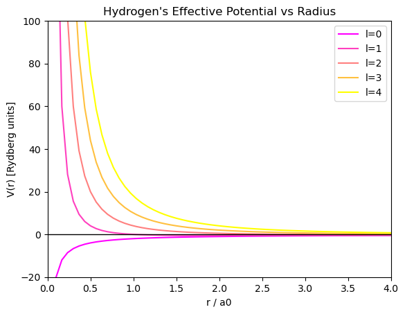
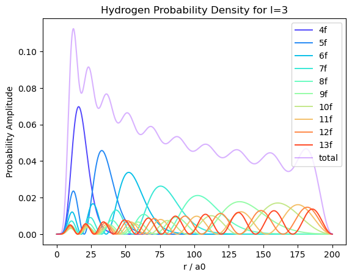
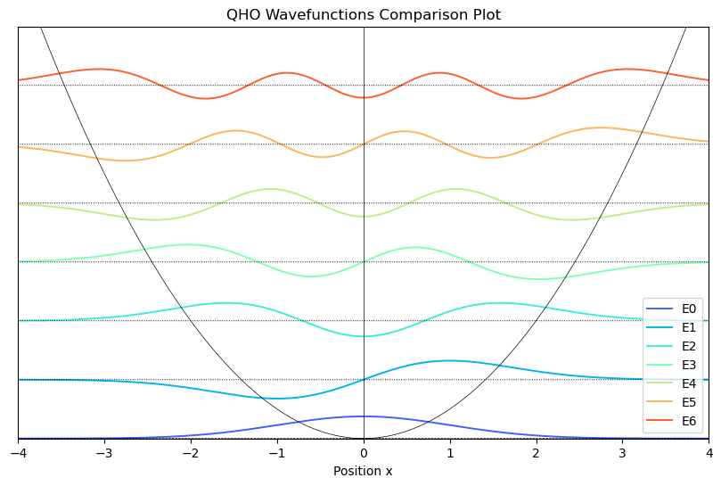
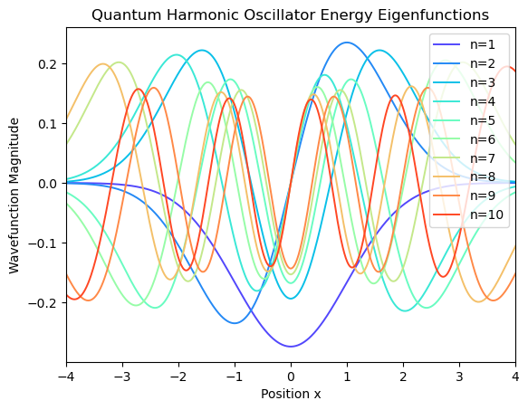

# Discretization-Matrix-Eigenvalue-Methods-Schrodinger-Equation
Discretizing space to reduce the Schrodinger equation into a finite dimensional eigenvalue problem, applying this to the quantum harmonic oscillator and the hydrogen atom.

# Condenced Methodology

By discretizing space into N points the infinite dimensional Hilbert space Hamiltonian is reduced to a NxN matrix, the kinetic term is approximated by the finite-difference approximation, entailing that each point only couples with its neirest neighbours. The potential term is produced and added to form the Hamiltonian, this differs between the quantum harmonic oscillator where it's simply quadratic and the hydrogen atom where it's the Coulomb potential evaluated radially from the centre of the atom. The resulting Hamiltonian matrix is solved using 'numpy.linalg.eigh' so extract the energy eigenvalues and wavefunctions. Their accuracy is evaluated as well as the effect of disretization on this accuracy.

---

## Features of the Program

- Builds a Hamiltonian matrix from the tri-diagonal kinetic energy and potential terms for both the quantum harmonic oscillator and the hydrogen atom.
- Numerically solves a 3000x3000 Hamiltonian matrix using `numpy.linalg.eigh`
- Models the potential for a hydrogen atom using the Coulomb and centrifugal terms, plotting this for varying quantum angular momenta.
- Plots the first 10 wavefunctions for the hydrogen atom for the first 4 quantum angular momentum values, labeling each wavefunction by it's quantum energy number and electron subshell.
- Achieves negligible error for the first 200 energy levels.
- Includes plot of the probability distribution of each hydrogen wavefunction.

---

## Output Plots

> Plotting how varying discretization number N and the range over which to discrete effects the accuracy of the model.

> Plotting the hydrogen potential matrix produced.

> Plotting probability density of wavefunctions radially outwards from the centre of the atom for quantum angular momentum l=3. 

> Plotting the Quantum Harmonic Oscillator energy wavefunctions.

> Plotting the first 10 Quantum Harmonic Oscillator energy wavefunctions together.

---
